# articy3_renpy3
articy:draft 3 to Ren'Py 3 converter

The goal of this tool is to help visual novel creators to create most of their 
dialogue flow, interactions etc. in articy:draft 3 instead of writing rpy files directly.
This should make it easier to refactor the game and see how everything affects each other.

The tool can also convert character and variable definitions into Ren'Py readable format.

The tool handles only the most common use cases, and isn't meant to replace the actual
hard work needed to make the edge cases work. Feel free to dump the grunt work onto the tool
and concentrate your work on what actually makes your game unique!

## Table of contents
- [Overview of an example project](#overview-of-an-example-project)
- [Flow conversion](#flow-conversion)
  - [Setup the Dialogue Fragment Templates](#setup-of-the-dialogue-fragment-templates)
    - [Creating a Feature](#creating-a-feature)
    - [Python injections Feature](#python-injections-feature)
    - [Menu item Feature](#menu-item-feature)
    - [Injected fragment Template](#injected-fragment-template)
    - [Menu Template](#menu-template)
    - [Menu item Template](#menu-item-template)
  - [Dialogue](#dialogue)
  - [Dialogue Fragment](#dialogue-fragment)
  - [Injected Fragment](#injected-fragment)
  - [Menu](#menu)
  - [Menu Item](#menu-item)
  - [Jump](#jump)
- [Character conversion](#character-conversion)
  - [Python expectations](#python-expectations)
  - [Articy expectations](#articy-expectations)
- [Variable conversion](#variable-conversion)
- [How to run the tool](#how-to-run-the-tool)
  - [Exporting the data](#exporting-the-data)
  - [Example code](#example-code)

## Overview of an example project

This section shows how the example project is constructed and what kind of cases it should
be able to handle. If you have a commonly used case you would like to see featured, please
submit a patch or an issue. No promises on delivering any updates, but I'd love to see 
this tool helping multiple creators.

Overview of the test project. Simple chained Dialogue objects assuming linear progression.


start label contents, including menus, menu items and an explicit jump.


meet_select label contents, including implicit jumps.


meet_maeve label contents, very short piece with explicit jump.


meet_faye label contents, very short piece with explicit jump.


game_end label contents, including if-elif-else structure using Injected fragments.


Note: This tool does *NOT* do any conversion of scripts, so writing conditions etc. to pins
in articy will *NOT* transfer. Read more especially [Injected fragment](#injected-fragment) and
[Menu item](#menu-item) portions to learn more about how to achieve this.

## Flow conversion
### Setup of the Dialogue Fragment Templates
Background: articy needs you *first* to setup Features, which you can then use in Templates,
which are prototypes for each element, like Classes in Python.
#### Creating a Feature
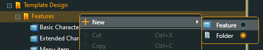
Create a Feature through right clicking Template Design -> Features -> New -> Feature and
naming your new Feature. Remember to match the "Technical name" with the one given in this guide.
Now select the newly created Feature and click the "Edit" button the upper right corner.
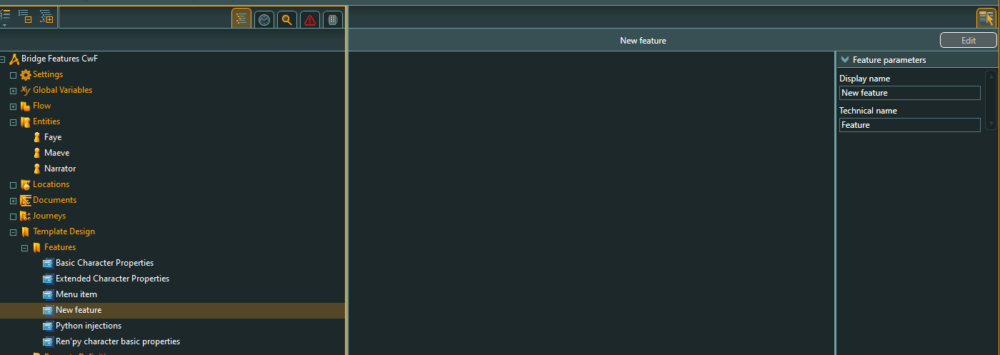
Finally you get a window where you can drag'n'drop different property types, name them, 
set their parameters etc. For the purpose of this tool, the "Technical name" is the one that
matters the most.
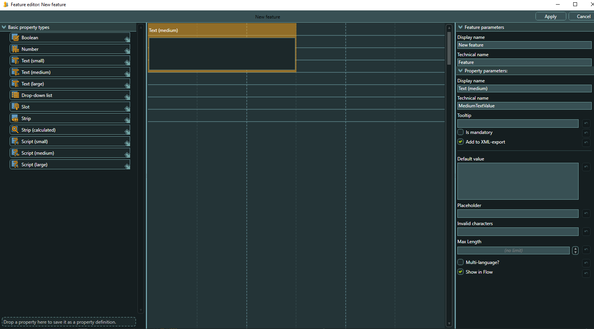

#### Python injections Feature
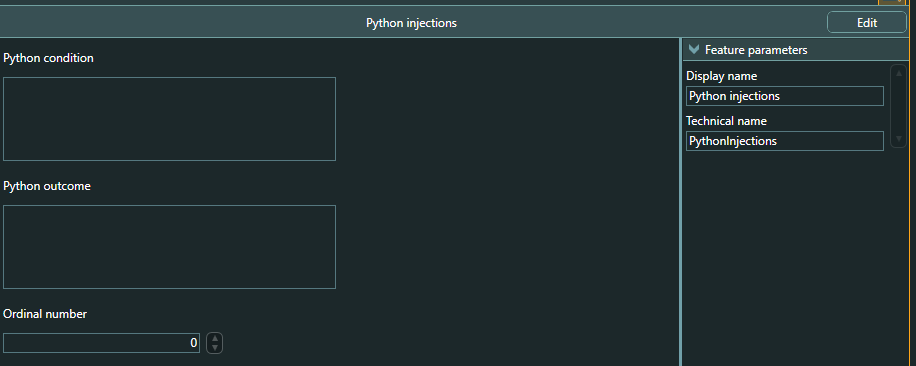
Create a new Feature with Technical name "PythonInjections".
Add the following fields to it:
- Medium text field called "PythonCondition" 
- Medium text field called "PythonOutcome"
- Number field called "OrdinalNumber"

#### Menu item Feature
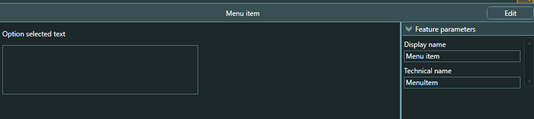
Create a new Feature with Technical name "MenuItem".
Add the following field to it:
- Medium text field called "OptionSelectedText"

#### Creating a Dialogue Fragment Template
Creating a Template is similar to creating Features, and is done through Templates ->
Dialogue Fragments -> Right click -> New -> Template
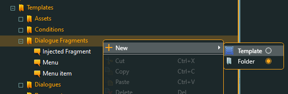
After creating and naming your new Template, edit it the same way you did with Features,
but this time instead of basic fields you're constructing your Template out of Features
you defined before. Technical name is again critical here.

#### Injected Fragment Template
Create a Template named "InjectedFragment" containing Feature:
- Python injections
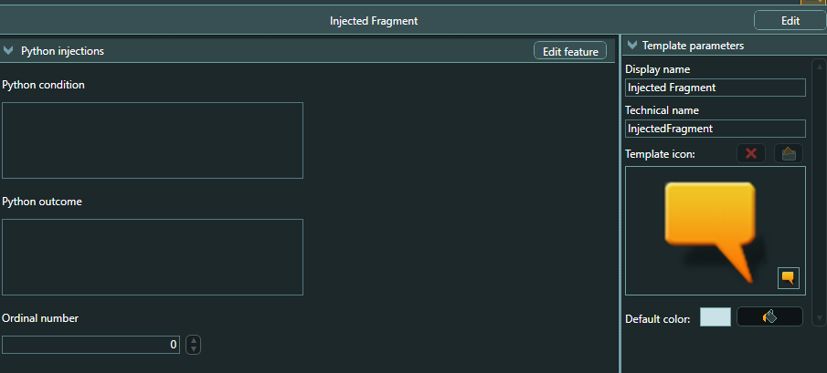

#### Menu Template
Create an empty Template named "Menu".
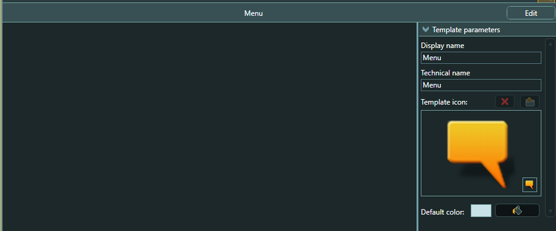

#### Menu Item Template
Create a Template named "MenuItem" cotaining Features:
- Menu item
- Python injections
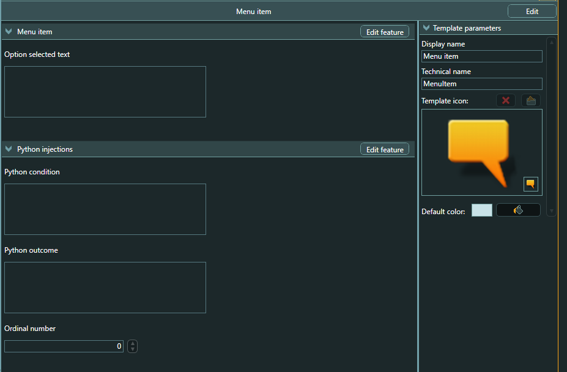

### Dialogue
Dialogue maps to label and its contents in Ren'py. If you want new label, create a new Dialogue.
These do not need any Template setup and work out of the box.

The name of the Dialogue (e.g. "start") tells the tool the label name. Description 
field tells the tool which Dialogues to search for when writing the files, so the 
Dialogues you want to write into the same file should have the same Description.
In this project I used the target filenames as descriptions. 

jump is created when a Dialogue is targeted by one the following scenarios:
- Explicit Jump object links directly to it
- Menu Item links directly to it
- When Dialogue links to another Dialogue, the last Fragment creates a jump

### Dialogue Fragment
Literally a single line of text in the story. Anything put into "Stage directions" is
written *before* the text with "scene" prefix, so use this for loading images. The text
itself goes into the "Description" box. If you want to omit the speaker, assign a proxy Entity
that doesn't have the correct RenCharacter template selected. In these examples I've used
"Narrator" as this type of proxy entity.
These do not need any Template setup and work out of the box.

### Injected Fragment
If you want to only show this piece only under certain conditions or do something
*after* the player goes through this test, this is the correct piece you need.

"Python condition" defines when this piece is shown and "Python outcome" what happens
after we go through this. You can use either one or both of these.
"Ordinal number" is for more complex situations such as in game_end, where we have
if-elif-elif-else struture. Since the tool can't know what is the correct order,
you need to tell it the correct order by assigning the numbers 1-2-3-4 accordingly.

### Menu
Menu is a glorified Dialogue Fragment. It has no special functionality, but it starts
a "menu:" in Ren'py and is always followed by one or multiple Menu Items.

### Menu Item
Identical to Injected Fragment except you can set "Option selected text" which is
shown *after* the player select this particular option. Only used after Menu.

### Jump
Jumps to targeted Dialogue. Can only target Dialogues.

## Character conversion

To get the characters to export correctly, you need to set up the structure in articy and/or
Python code to match each other first. The default setup assumes the following setup in articy
and Python:

### Python expectations
You have defined a Ren'py Character compatible class of your own that includes any and all
possible customizations and in addition forwards the calls to linked char. The default
implementation assumes this class's name is `RenCharacter` and supports only `Color` extra
attribute defined in articy. Example code:

```python
init -1 python:
    class RenCharacter:
        def __init__(self, name, color, met_already=False, **kwargs):
            self.char = Character(name, color=color, **kwargs)
            self.met_already = met_already

        def __call__(self, *args, **kwargs):
            self.char.__call__(*args, **kwargs)
```

### Articy expectations
To support the custom values, you need to define a feature called RenCharProps in articy.


After creating template, you need to define entity called RenCharacter under the Entities
menu:


Finally you can define the characters in articy by right clicking the Entities menu and
selecting the correct Template:


You will see the chose template and can change the parameters via the Template tab of the
Entity:


## Variable conversion

In articy you need to define namespace in order to define global variables. articy3_renpy3 takes
these namespaces and converts them to python definitions verbatim so that variable x in
namespace flags will be defined as flags.x. Please note that the names and default values
are *NOT* converted in anyway.

Note you need to first create a new variable set under Global Variables in articy before 
you can add any variables.


## How to run the tool
1. Export the data from articy 
2. Create a Converter entity
3. Read the data in
4. Write the output(s) you're interested in

### Exporting the data
Go to upper left corner of articy with two character button, press it and then select
"Export".
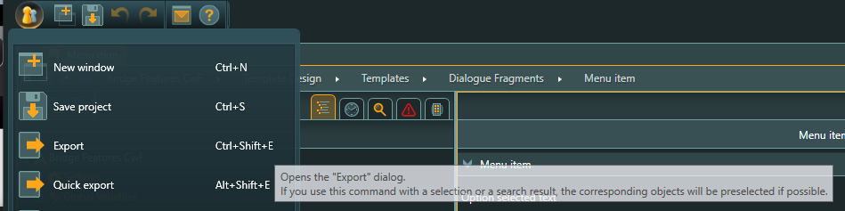

Select Technical export -> .json, and select to export everything -> OK.
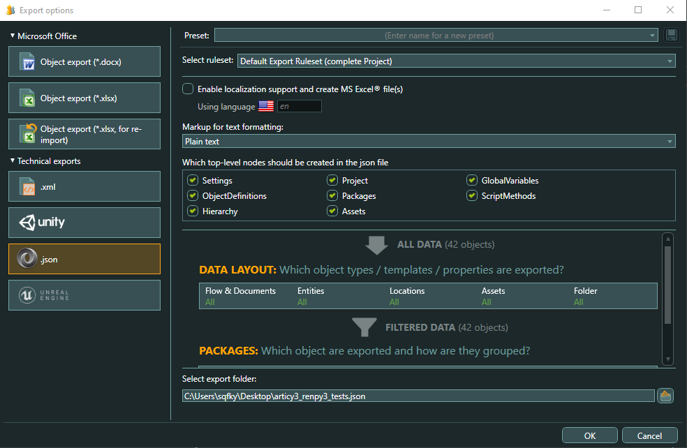

### Example code
```python
from pathlib import Path

file_in = Path(r"C:\Temp\file_in.json")
char_out = Path(r"C:\Temp\chars.rpy")
vars_out = Path(r"C:\Temp\vars.rpy")
script_out = Path(r"C:\Temp\script.rpy")
scene_1_out = Path(r"C:\Temp\scene_1_out.rpy")
scene_2_out = Path(r"C:\Temp\scene_2_out.rpy")

c = Converter(input_file=file_in)
c.read_input()
# Write character and variable data
c.write_init_rpy(file_type='character', output_path=char_out)
c.write_init_rpy(file_type='variable', output_path=vars_out)

# Write all three target files
c.write_scene_rpy(target_file="script.rpy", output_path=script_out)
c.write_scene_rpy(target_file="scene1.rpy", output_path=scene_1_out)
c.write_scene_rpy(target_file="scene2.rpy", output_path=scene_2_out)
```
