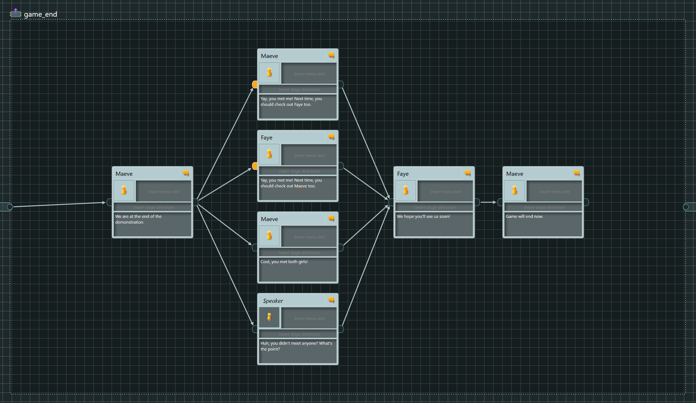

# articy3_renpy3
articy:draft 3 to Ren'Py 3 converter

The goal of this tool is to help visual novel creators to create most of their 
dialogue flow, interactions etc. in articy:draft 3 instead of writing rpy files directly.
This should make it easier to refactor the game and see how everything affects each other.

The tool can also convert character and variable definitions into Ren'Py readable format.

The tool handles only the most common use cases, and isn't meant to replace the actual
hard work needed to make the edge cases work. Feel free to dump the grunt work onto the tool
and concentrate your work on what actually makes your game unique!

## Table of contents
- [Flow conversion](#flow-conversion)
- [Character conversion](#character-conversion)
  - [Python expectations](#python-expectations)
  - [Articy expectations](#articy-expectations)
- [Variable conversion](#variable-conversion)

## Flow conversion

### Overview of example project

This section shows how the example project is constructed and what kind of cases it should
be able to handle. If you have a commonly used case you would like to see featured, please
submit a patch or an issue. No promises on delivering any updates, but I'd love to see 
this tool helping multiple creators.

Overview of the test project. Simple chained Dialogue objects assuming linear progression.


start label contents, including menus, menu items and an explicit jump.


meet_select label contents, including implicit jumps.


meet_maeve label contents, very short piece with explicit jump.


meet_faye label contents, very short piece with explicit jump.


game_end label contents, including if-elif-else structure using Injected fragments.


Note: This tool does *NOT* do any conversion of scripts, so writing conditions etc. to pins
in articy will *NOT* transfer. Read more especially [Injected fragment](#injected-fragment) and
[Menu item](#menu-item) portions to learn more about how to achieve this.

### Dialogue

### Dialogue Fragment

### Injected Fragment

### Menu

### Menu Item

### Jump

Current the tool assumes the following structure:
1. Main dialogue level named according to the labels. Target filenames are in text field.
2. Dialogue fragments have speakers with lines. Any scene commands etc. are assumed to be in "stage direction" portion of the dialogue frament.

## Character conversion

To get the characters to export correctly, you need to set up the structure in articy and/or
Python code to match each other first. The default setup assumes the following setup in articy
and Python:

### Python expectations
You have defined a Ren'py Character compatible class of your own that includes any and all
possible customizations and in addition forwards the calls to linked char. The default
implementation assumes this class's name is `RenCharacter` and supports only `Color` extra
attribute defined in articy. Example code:

```python
init -1 python:
    class RenCharacter:
        def __init__(self, name, color, met_already=False, **kwargs):
            self.char = Character(name, color=color, **kwargs)
            self.met_already = met_already

        def __call__(self, *args, **kwargs):
            self.char.__call__(*args, **kwargs)
```

### Articy expectations
To support the custom values, you need to define a feature called RenCharProps in articy.


After creating template, you need to define entity called RenCharacter under the Entities
menu:


Finally you can define the characters in articy by right clicking the Entities menu and
selecting the correct Template:


You will see the chose template and can change the parameters via the Template tab of the
Entity:


## Variable conversion

In articy you need to define namespace in order to define global variables. articy3_renpy3 takes
these namespaces and converts them to python definitions verbatim so that variable x in
namespace flags will be defined as flags.x. Please note that the names and default values
are *NOT* converted in anyway.

Note you need to first create a new variable set under Global Variables in articy before 
you can add any variables.


